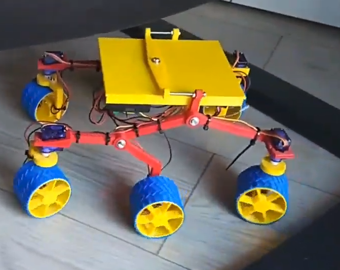
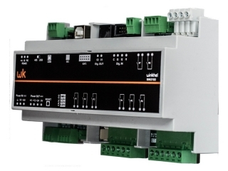
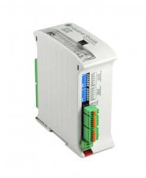
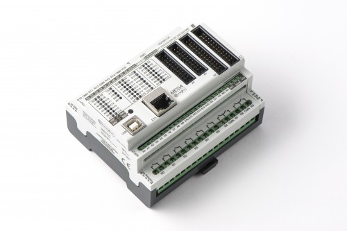

# ¿Una charla sobre qué?

## Instituto Virgen de las Nieves

## 19 de Febrero de 2019 9:05

### ¿Una charla sobre qué?

#### Os cuento mi última semana ....

Soy muy fan de 

### El pobre Opportunity ...

### Ya no nos duran nada ...

## Me consultan unos chavales del CEIP Federico García Lorca

## Para hacer un proyecto sobre el espacio

### Me acuerdo de Felix y su Curiosity BTL

[Bricolabs Curiosity BTL](https://bricolabs.cc/wiki/proyectos/curiosity_btl)

## Me pongo manos a la obra y [...](https://github.com/javacasm/Curiosity_btl)

### Me encuentro con un problema: no me funciona un problema de 15 líneas ...

### Menos mal que @luisLlamas ya lo ha resuelto y [compartido](https://www.luisllamas.es/salidas-analogicas-pwm-en-arduino/)

#### Hago esto ...

[Vídeo](https://photos.app.goo.gl/wyZHRgwfbKUe8Zgx5)

## Les gusta la idea pero ... 

[Modelo](https://www.thingiverse.com/thing:3432863)

## Pero queremos que se parezca más al Curiosity real

### Paneles solares ... 

#### Un grupo de estudiantes sevillanos de @jose_pujol se está encargando de ello 
#### Y de revisar la estructura...

### Comunicaciones

#### Conozco a [G4lile0](https://twitter.com/G4lile0) ....

[Video](https://twitter.com/i/status/926621997861408769)

[Modelo](https://www.thingiverse.com/thing:2513566)

### [Satélite OpenSource](https://twitter.com/G4lile0/status/1095479960045789189)

### Fossa Systems

### Aprendo de comunicaciones Lora con tutoriales de [@akirasan](http://akirasan.net/tag/lora/)

### También quiero una cámara que  gire 

### y recuerto a [Er Tito Manolo](http://3drf.com/pan-tilt-head/)

### Quiero añadir una estación meteorológica que analice la calidad del aire

### Me encuentro que mi amigo Federico y otros han publicado [esto](https://github.com/fgcoca/estacion-dashboard)

# El #OpenSource acorta distancias y rebaja las dificultades. Gracias

### Pero las patentes y los secretos ...

# ¡¡¡ Gracias por compartir el conocimiento !!!

### Anteriormente ....

## ¿Un robot que juega al Hockey de aire?

[video](https://www.youtube.com/watch?v=CjzSeOg8oTs)

[Proyecto](http://jjrobots.com/air-hockey-robot-a-3d-printer-hack/)

[Código y modelos](https://github.com/JJulio/AHRobot  )

## [Thor: Brazo robótico](https://github.com/bqlabs/Thor)

## [Robot cuadrúpedo ¡que salta! miniKame](https://github.com/bqlabs/miniKame)

[Búsqueda en Google](https://www.google.es/search?q=minikame&client=ubuntu&hs=yJN&source=lnms&tbm=isch&sa=X&ved=0ahUKEwjC8Z3-n8fgAhXlYN8KHbmoBQQQ_AUIDigB&biw=1920&bih=914#imgrc=reTM95qlO4_BOM:)

## Robótica en los colegios

* Extraescolares

  * Antes 100% Lego: una herramienta fantástia pero cara y cerrado

  * Escornabot
  * SkyBot

* En las aulas

## Automatismos

### Arduino vs PLC

[Winkhel](http://www.electan.com/miniautomata-plc-arduino-winkhel-p-3273.html)

[Industrial Shields](http://www.industrialshields.com/)

[Controllino](http://controllino.cc/)

### [Raspberry](./raspberry/charla.md)

## Recursos

* Movimiento open source
  * Open source: Una historia de éxitos
    * [Linux](http://www.linux.org/) el 80% de los grandes servidores de internet usan Linux
    * Programas de diseño 3D
      * [Freecad](http://freecad.org)
      * [OpenScad](http://openscad.org)
      * [Blender](http://blender.com)
    * Repositorios de código
      * [GitHub](http://GitHub.com)
    * [Android](http://android.com)
  * Open Hardware
    * [Arduino](http://arduino.cc)
    * [Raspberry](http://raspberry.org)
    * [ESP8266](http://www.esp8266.com/)
    * [FPGA](https://github.com/Obijuan/open-fpga-verilog-tutorial/wiki)
    * Impresoras 3D  
      * [Movimiento RepRap](http://reprap.org)
    * Scanner 3D
      * Ciclop
    * Drones  
  * Repositorios de modelos
    * [Thingiverse](http://Thingiverse.com)
    * [YuoMagine](http://youmagine.com)
    * [GitHub](http://GitHub.com)
  * Repositorios de  proyectos
    * [Instructables](http://Instructables.com)
    * [Makezine](http://makezine.com)
  * Repositorios de conocimiento
    * [Adafruit](http://adafruit.com)
    * [Sparkfun](http://sparkfun.com)
    * [Arduino playground](http://playground.arduino.cc)
  * Empresas que trabajan en OpenSource
    * Bq [GitHub](https://github.com/bq) [I+D labs](https://github.com/bqlabs)
